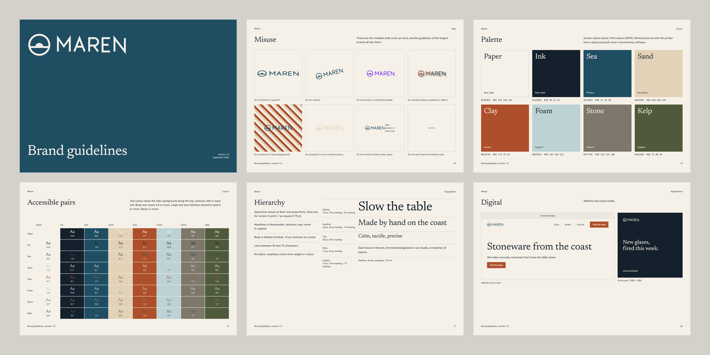
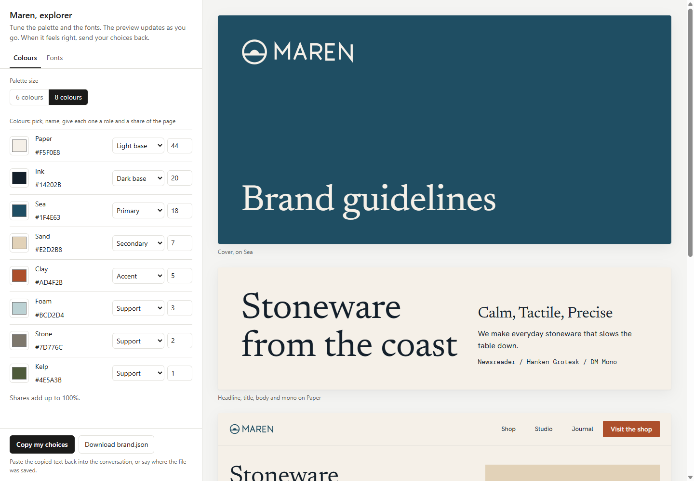
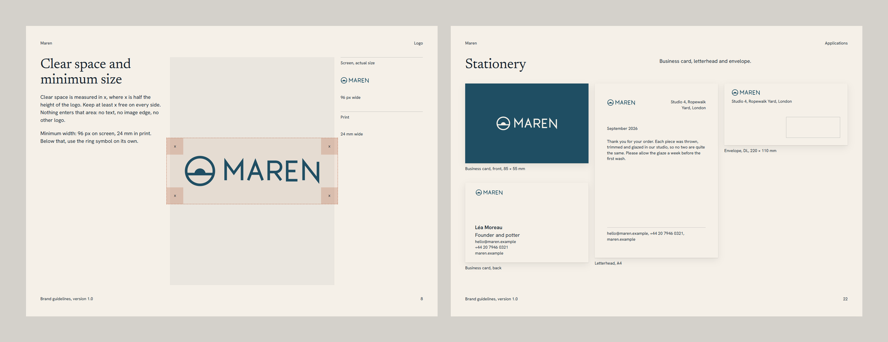

# Brand Book

A Claude skill that builds a full brand guidelines document from a few decisions: some style words, a
colour direction, and a logo if you have one.



The example above is Maren, a ceramics studio that does not exist. The whole book comes from one
[`brand.json`](docs/example/brand.json) and one [SVG logo](docs/example/logo.svg). You can page through
[the book](https://gutslfo.github.io/brand-book/) and try [the explorer](https://gutslfo.github.io/brand-book/explorer.html)
in your browser.

## How it works

The whole thing is a conversation with Claude, in five steps.

1. You start with one message: the brand name, what it does, three to five style words, a colour
   direction in plain words, 6 or 8 colours, and the logo if there is one.
2. Claude proposes a palette and three font pairings, then opens the explorer, a picker page with a
   live preview. You adjust each colour, choose fonts from 46 Google Fonts, switch between 6 and 8
   colours, and watch the contrast checks update as you go. A button sends your choices back.
3. Then comes the interview: about twenty questions, one at a time, in the order of the book, on what
   the brand should look like and what it must never look like. Purpose, voice, clear space, minimum
   size, approved backgrounds, colour proportions, type scale, corners, imagery, the don'ts. Each
   question arrives with drafted answers, so most of the time you pick and correct rather than write
   from scratch. "Decide for me" also works.
4. Before building anything, Claude shows the plan of all 27 pages with the content each one will
   carry, and waits for your yes.
5. The book is one HTML file. It reads on a laptop and on a phone, and prints to A4 landscape as a
   27-page PDF. Claude checks contrast, overflow, text size and clipping before showing it to you.



## What is in the book

| Chapter | Pages |
|---|---|
| Essence | Purpose and personality, voice as "we are / we are not" pairs, a line to write and a line to avoid |
| Logo | Primary and reversed, clear space measured in x, minimum size at actual size, approved backgrounds, eight misuse examples drawn from your own logo |
| Colour | Palette with roles, HEX and RGB, proportions, and a matrix of every text and background pair with its contrast ratio |
| Typography | Each family with its job and weights, then a five-level hierarchy with sizes, leading and tracking |
| Layout and imagery | The twelve-column grid with its margins, image direction with do and do not |
| Applications | Business card, letterhead, envelope, website, social post, title slide, email signature |
| Never | The global don'ts |
| Tokens | CSS variables, with buttons to download `tokens.css` and `brand.json` |



## Where the rules come from

The chapters and numbers come from the published guidelines of 19 brands in the 2025 Interbrand and 2026
Kantar BrandZ top-100 rankings: Microsoft, Google, IBM, Visa, Mastercard, Netflix, Spotify, Meta,
Instagram, YouTube, Adobe, Cisco, eBay, Slack, Starbucks, Mailchimp, and (from secondary sources) Uber,
Airbnb and Siemens.

Some of the things they agree on, which the book applies:

- Clear space is measured with a unit taken from the logo itself, never in pixels. Visa uses the height
  of the V, Netflix the width of one leg of the N, Microsoft the height of the symbol.
- Minimum sizes come in pairs, one for screen and one for print. Spotify's logo stops at 70 px and 20 mm.
- The misuse lists overlap almost entirely. Stretching, rotating, recolouring, adding effects and busy
  backgrounds each appear in at least two of the guides.
- Most surfaces are neutral, carrying one colour the brand owns. The accent is used sparingly.
- Two or three type families, each with a named job, and few weights. eBay uses regular and bold,
  nothing else.
- eBay sets the page margin equal to the logo clear space: 5% of the layout's shortest side. The book
  uses that rule for its own margins.

The sources, the numbers, and a few house rules for the document itself (no italics, no decorative
numbering, nothing under 12 px) are in [`references/canon.md`](references/canon.md).

## Install

**Claude Code**

```bash
git clone https://github.com/gutslfo/brand-book ~/.claude/skills/brand-book
```

**Claude.ai**

Download the repository as a ZIP and upload it in the Skills section of your claude.ai settings.

The scripts need Python 3 and nothing else.

## Use

Ask for it in plain words:

> Make brand guidelines for a small bakery called Levain. Warm, honest, a bit old-fashioned. Browns and
> a deep green, 6 colours. The logo is in ./levain-logo.svg.

Everything lands in a `levain-brand/` folder: `brand.json`, `explorer.html`, `brand-book.html`. To
change something later, edit `brand.json` and rebuild:

```bash
python ~/.claude/skills/brand-book/scripts/build.py book levain-brand/brand.json
```

To get a PDF, print the book from Chrome or Edge: A4, landscape, no margins, background graphics on.

## Limits

- The book's own labels (chapter names, captions) are in English. The brand's content can be in any
  language.
- Every book shares one structure. Brands differ by colour, type, logo, words and density.
- Fonts load from Google Fonts. A licensed font needs its own `@font-face`.

## Files

```
SKILL.md                    the method Claude follows
references/canon.md         what the biggest brands put in their guidelines, with sources
references/interview.md     the questions, chapter by chapter
references/palette-and-type.md  how the first palette and font pairings are proposed
references/schema.md        every brand.json field, and the 27-page plan
assets/explorer.html        colour and font picker template
assets/brand-book.html      brand book template
scripts/build.py            brand.json + template -> one self-contained HTML file
scripts/check.py            validates brand.json and its contrast before a build
scripts/audit.js            checks the rendered book in a browser
docs/                       the Maren example
```

## Licence

MIT. Made by Pierre Tran at [Taykon Studio](https://taykon.studio), Geneva.
