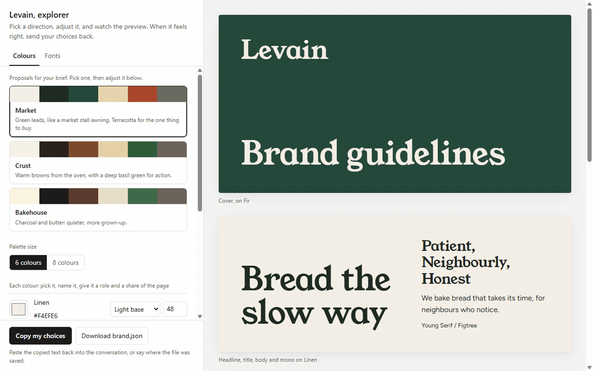
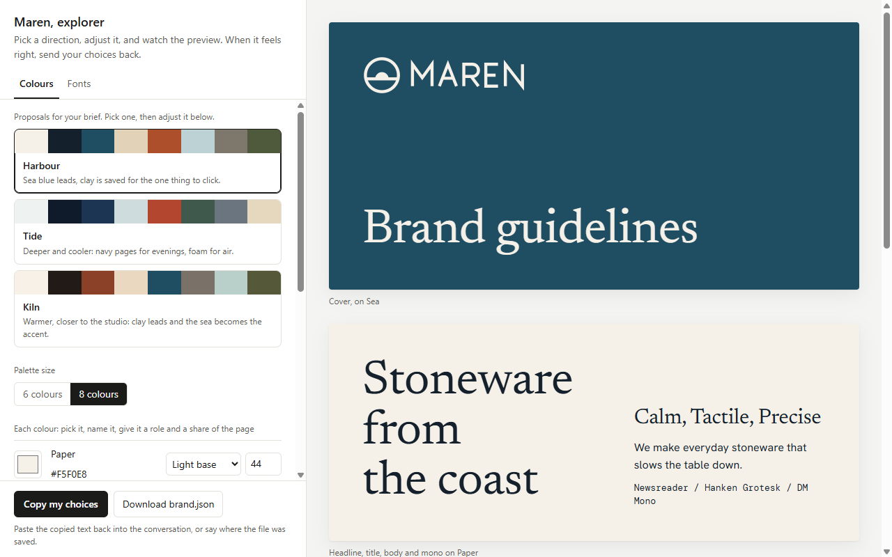
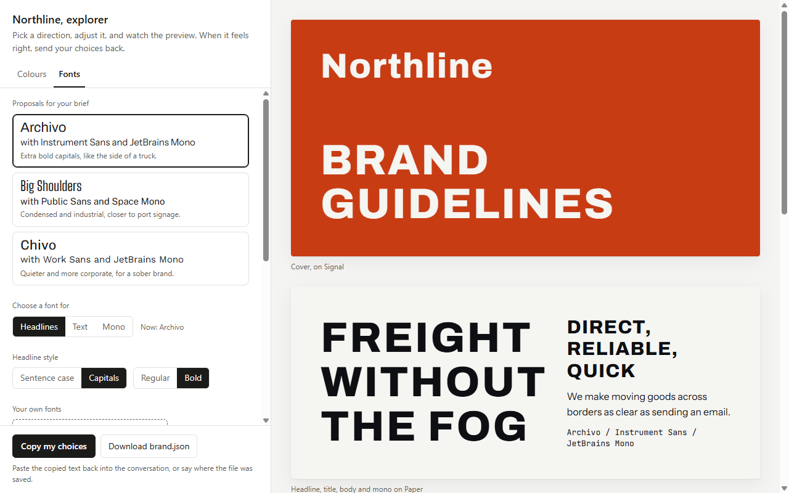
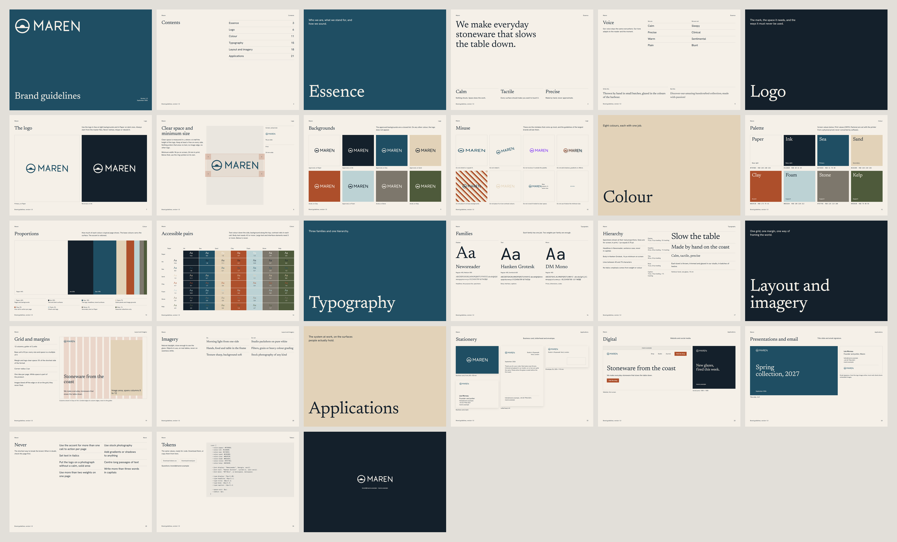
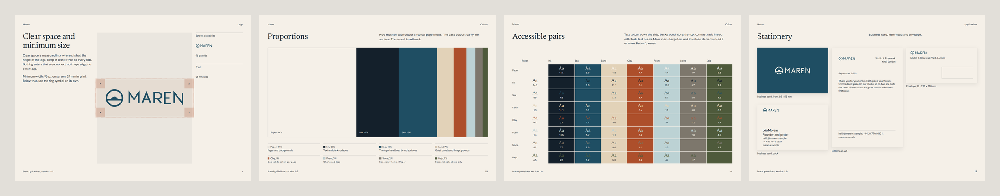
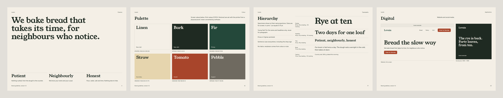
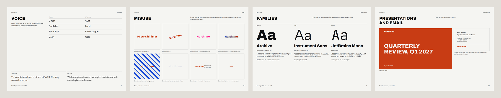

# Brand Book

**A Claude skill that builds brand guidelines the way the world's largest brands build theirs.**

Tell it what you already have: a logo, some colours, a font, or nothing at all. It asks a few questions
about the rest, shows you colour and font proposals in a live picker, and writes a 27-page brand book you
can hand to a printer or a developer.

[**See the three example books**](https://gutslfo.github.io/brand-book/) ·
[**Try the picker**](https://gutslfo.github.io/brand-book/levain/explorer.html) ·
[**Install**](#install)


## Why this exists

A proper brand book takes a studio weeks. What makes it proper is the unglamorous part: how much space
the logo needs, how small it can go, which colour goes on which, how big a headline is, what nobody is
allowed to do. That part is written down, in the published guidelines of Microsoft, Google, Visa,
Spotify, Netflix and the rest.

This skill applies those rules to your brand and hands you the finished document. The taste stays yours: you choose every colour and every font, and anything you already
decided is never questioned.

## How it works

### 1. Say what you already have

Claude starts by asking what exists: a logo, colours, fonts. Whatever you bring stays as it is and
shows up in every proposal, marked as yours.

### 2. Answer a few questions, only about what is missing

No colours yet? No fonts? A handful of questions with ready-made answers to pick from: the feeling you
are after, light or dark, a colour you love or refuse, classic or modern type, a brand you admire and one
you would hate to be mistaken for. It goes roughly like this:

> **You:** Make brand guidelines for my bakery, Levain.
>
> **Claude:** What do you already have? A logo (yes, not yet), colours (all, some, none), fonts
> (defined, one of them, none)?
>
> **You:** Nothing yet.
>
> **Claude:** Which is closest: quiet and refined, warm and human, bold and energetic, sharp and
> technical? Light pages or dark? A colour you love or refuse? Serif or sans? A brand you admire, and one
> you'd hate to be confused with?
>
> **You:** Warm, honest, a bit old-fashioned. Light. Browns and a deep green. Serif. I love Poilâne; I
> don't want to look like a supermarket bakery aisle.

The more you say, the sharper the proposals. Claude then searches the Google Fonts catalogue for faces
that fit (leaving out the thirty most used fonts on the web, so it doesn't look like every generated
site) and builds three palette directions that pass contrast checks before you ever see them.

### 3. Choose in the picker, not in the chat

The answers come back as a page you can click through.



- Three palette directions to click between, each with a one-line reason, then every colour editable
  with a colour picker, a name, a role and its share of the page.
- Font pairings with a reason each, a shortlist picked for the brand, and search across all 1,608 Latin
  families of Google Fonts.
- Your own fonts: drop in a `.woff2`, `.otf` or `.ttf` file, or type the name of a font installed on
  your computer. It shows in the preview straight away and gets embedded in the book.
- A live preview: cover, headlines and text, a website, the palette, the logo on every colour, and
  contrast checks that turn red when a pair fails.
- Switch between 6 and 8 colours, sentence case or capitals, regular or bold headlines.

When it looks right, press **Copy my choices** and paste into the conversation.

| Palette proposals | Font proposals and search |
|---|---|
|  |  |

### 4. Get the book

Claude writes the words (purpose, voice, rules, the don'ts) from what you told it, builds the book,
checks it at four screen widths, and sends you one HTML file. It reads on a laptop and on a phone, and
prints as 27 A4 pages.



## Three brands, same skill

Each example started from a different situation. Open the books and the pickers on the
[demo site](https://gutslfo.github.io/brand-book/).

**Maren**, a ceramics studio. Logo supplied, colours and fonts proposed.
[Book](https://gutslfo.github.io/brand-book/maren/brand-book.html) ·
[Picker](https://gutslfo.github.io/brand-book/maren/explorer.html) ·
[brand.json](docs/maren/brand.json)



**Levain**, a bakery. Nothing defined, no logo: the name becomes the wordmark.
[Book](https://gutslfo.github.io/brand-book/levain/brand-book.html) ·
[Picker](https://gutslfo.github.io/brand-book/levain/explorer.html) ·
[brand.json](docs/levain/brand.json)



**Northline**, a freight company. Eight colours, headlines in capitals, a monospace face for tracking
numbers. [Book](https://gutslfo.github.io/brand-book/northline/brand-book.html) ·
[Picker](https://gutslfo.github.io/brand-book/northline/explorer.html) ·
[brand.json](docs/northline/brand.json)



## What is in the book

| Chapter | Pages |
|---|---|
| Essence | Purpose and personality, voice as "we are / we are not" pairs, a line to write and a line to avoid |
| Logo | Primary and reversed, clear space measured in x, minimum size at actual size, approved backgrounds, eight misuse examples drawn from your own logo |
| Colour | Palette with roles, HEX and RGB, proportions, and every text and background pair with its contrast ratio |
| Typography | Each family with its job, weights and character set, then five levels with size, leading and tracking |
| Layout and imagery | The twelve-column grid and its margins, image direction with do and do not |
| Applications | Business card, letterhead, envelope, website, social post, title slide, email signature |
| Never | The brand's own don'ts |
| Tokens | CSS variables, with buttons to download `tokens.css` and `brand.json` |

## Built on what the largest brands publish

The chapters and the numbers come from the published guidelines of 19 brands in the 2025 Interbrand and
2026 Kantar BrandZ top 100 rankings. A sample of what they say about the logo:

| Brand | Clear space around the logo | Smallest size on screen |
|---|---|---|
| Microsoft | the height of the four-square symbol | 16 px symbol, 72 px full logo |
| Visa | the height of the V, on every side | 36 px |
| Spotify | half the height of the logotype | 70 px logo, 21 px icon |
| Instagram | half the glyph's size | 29 px |
| Netflix | the width of one leg of the N | |
| eBay | the x-height; clear space and page margin both 5% of the shortest side | 24 px high |

What they agree on, and what every book this skill makes applies:

- Clear space is measured with a part of the logo itself, never in pixels, so it scales with the logo.
- Minimum sizes come in pairs, one for screen and one for print.
- The misuse lists overlap almost entirely: stretching, rotating, recolouring, effects and busy
  backgrounds all appear in several of them.
- Most surfaces are neutral, around one colour the brand owns. The accent is used sparingly.
- Two or three type families, each with a named job, and few weights.
- eBay sets the page margin equal to the logo clear space. The books use that rule for their own margins.

Every source and every number is in [`references/canon.md`](references/canon.md).

## Checked before you see it

Generated documents usually give themselves away in the details, so the skill checks them.

- `check.py` runs before every build. It checks every palette, the proposals included, against WCAG
  2.2 contrast for body text, buttons, headlines and brand surfaces. It confirms every font exists on
  Google Fonts with the weights requested (a missing weight silently breaks loading), and that shares
  add up to 100.
- `audit.js` runs in a browser on the finished book at 1440, 1180, 900 and 390 px. It catches pages
  that overflow, clipped specimens, text under 12 px, italics, fonts that failed to load, and any logo
  shown below its own minimum size.
- The document follows its own house rules: no italics, no little kicker lines above titles, no
  decorative numbering, one type scale, one grid. These are the tells that make a page read as generated
  rather than commissioned.

## Install

**Claude Code**

```bash
git clone https://github.com/gutslfo/brand-book ~/.claude/skills/brand-book
```

Then start a new session and ask for brand guidelines. The skill loads on its own.

**Claude.ai**: download this repository as a ZIP and upload it in the Skills section of your settings.
I have not tried this route yet; reports are welcome in the issues.

You need Python 3 (no packages) and a browser to open the picker and the book. A browser tool for Claude
(for example the Playwright MCP server) is optional: with one, Claude also runs the render audit itself.

## Use

Ask in plain words. A few ways in:

> Make brand guidelines for a small bakery called Levain. Warm, honest, a bit old-fashioned.

> I have our colours (#0B3D91, #FC3D21, white) but no fonts. Build our brand book.

> Here is our logo, our palette and our two font files. Turn them into proper guidelines.

Everything lands in a `<brand>-brand/` folder: `brand.json`, `explorer.html`, `brand-book.html`, plus
your logo and font files. To change something later, edit `brand.json` and rebuild:

```bash
python ~/.claude/skills/brand-book/scripts/build.py book levain-brand/brand.json
```

For a PDF, print the book from Chrome or Edge: A4, landscape, no margins, background graphics on.

## Under the hood

One file, `brand.json`, holds every decision. Two HTML templates read it: the picker and the book. The
build embeds the logo, your images and your font files as data, so each page is a single file you can
email.

```
SKILL.md                        the method Claude follows
references/intake.md            the opening questions
references/palette-and-type.md  how palettes and pairings are proposed
references/canon.md             what the largest brands publish, with sources
references/schema.md            every brand.json field, and the page each one feeds
references/interview.md         the optional page-by-page refinement
assets/explorer.html            the picker template
assets/brand-book.html          the book template
assets/fonts.json               the Google Fonts catalogue (refresh with fonts.py)
scripts/fonts.py                search the catalogue, check names and weights
scripts/build.py                brand.json + template -> one self-contained HTML file
scripts/check.py                palette, contrast and font checks
scripts/audit.js                the in-browser render audit
docs/                           the demo site and the three examples
```

## Questions

**Does it design a logo?** No. Bring one (SVG is best), or the brand name is set in your display font
and used as a wordmark. The book then shows its clear space, minimum size and misuse like any logo.

**Can I use a font that isn't on Google Fonts?** Yes. Add the file in the picker, or give it to Claude.
It is embedded in the book so it shows on any machine. Check that your licence allows embedding.

**Can the book be in another language?** Everything you write into it can. The book's own labels
(chapter names, captions) are in English for now.

**Can I change the layout?** Every brand gets the same 27-page structure; brands differ by colour, type,
logo, words and density. The templates are plain HTML and CSS if you want to fork them.

**What if I want to change the words after?** Ask Claude to go through the pages with you. It walks the
book chapter by chapter, one question at a time, and rebuilds.

## Contributing

Issues and pull requests are welcome. Useful directions: translated labels for the book, more page
layouts, more example brands, and reports from claude.ai.

## Licence

MIT. Use it for your own brand, your clients' brands, or build on it; keep the copyright notice.

Made by Pierre Tran at [Taykon Studio](https://taykon.studio), Geneva, to give founders the kind of
brand book that usually takes a studio weeks.
